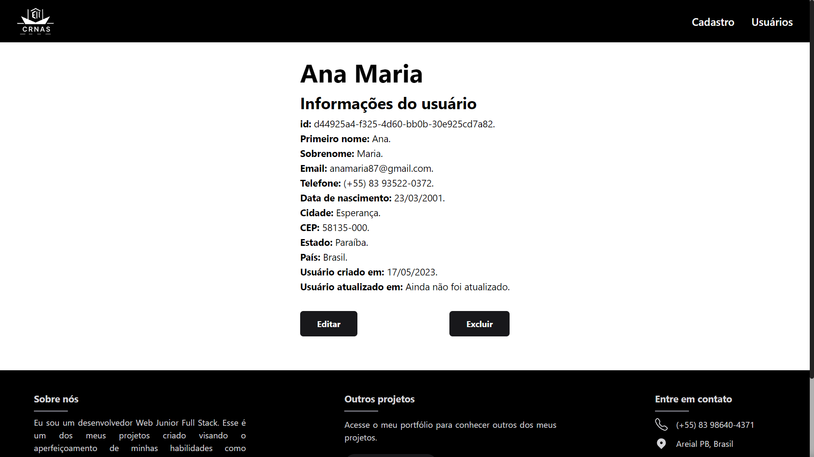
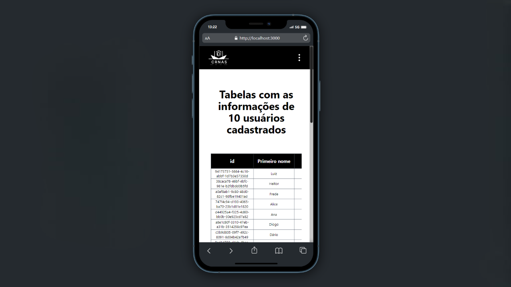

# Cadastro de usuários - Frontend

  
  

## Projeto

### Propósito

O motivo de sua criação é ser o primeiro projeto Full Stack, colocando os conhecimentos de cada área em prática.
Sendo o Frontend, utiliza a API RESTful criada para guardar e lidar com os usuários cadastrados. Todas as rotas criadas na API são usadas.

### O que irá encontrar:

<ul>
  <li>
    Página inicial com o motivo da criação do projeto.
  </li>
  <li>
    Página com formulário para cadastrar um novo usuário;
  </li>
  <li>
    Última página responsável por mostrar em uma tabela os usuários cadastrados, com paginação e mostrando 10 usuários por vez;
  </li>
  <li>
    Botão para editar usuários, redirecionando para uma página dedicada a esse propósito, com todos os campos preenchidos com as atuais informações do usuário;
  </li>
  <li>
    Botão para excluir usuário, que abre uma pop-up de confirmação caso tenha sido pressionado acidentalmente, evitando uma exclusão não intencional.
  </li>
</ul>

## Como usar

### Caso queira baixar, testar ou alterar o projeto, siga os seguintes passos:

#### Clonar

Primeiro clone o repositório com: git clone [link HTTPS ou SSH do repositório]

Pode conseguir esse link acessando o repositório que quer clonar, e apertando em um botão verde com o nome "<> CODE".

#### Baixar dependências

Depois baixe todas as dependências necessárias: npm i

#### Rodar

Rode o projeto com: npm run dev

## Screenshots

<h3>Desktop</h3>

<h3>Mobile</h3>

## 🛠 Tecnologias

As seguintes ferramentas foram usadas na construção desse projeto:

-   [TypeScript](https://www.typescriptlang.org/)
-   [Next.js](https://nextjs.org/)
-   [TailwindCSS](https://tailwindcss.com/)
-   [REACT HOOK FORM](https://react-hook-form.com/)
-   [YUP](https://github.com/jquense/yup)

 

## Autor

  <b>Dário Matias</b>

 
  Entre em contato!
 
 

